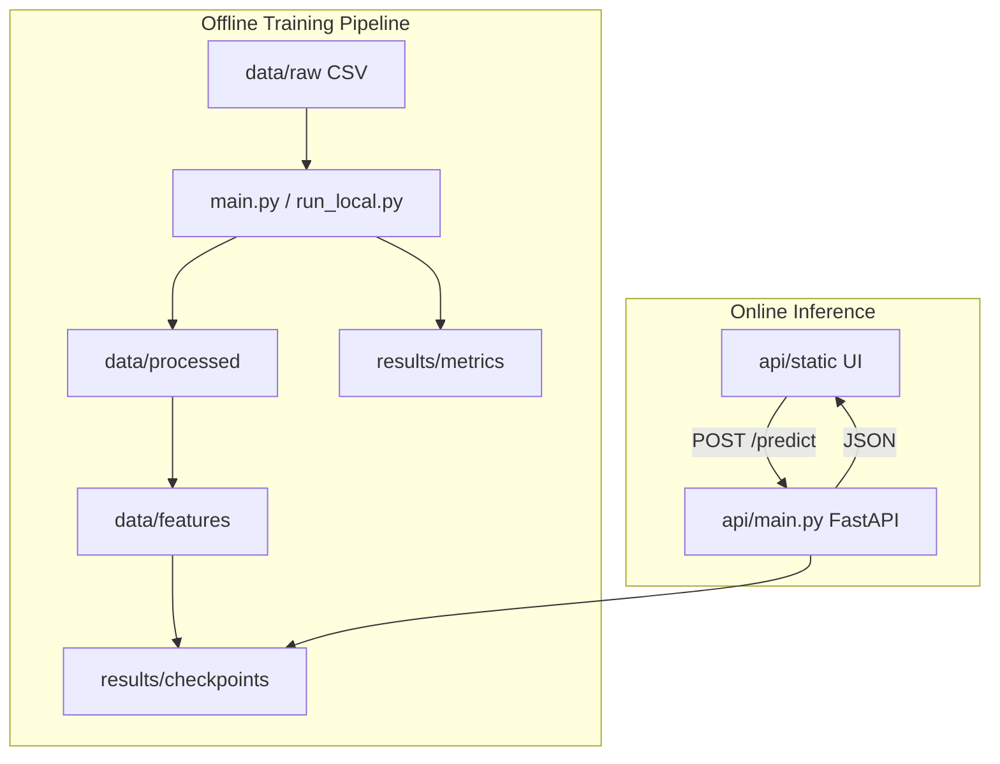
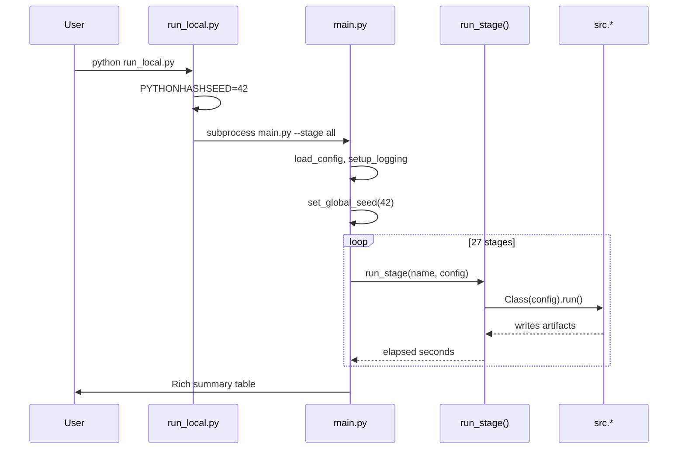
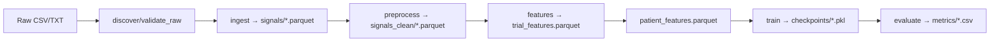

# GaitGuard Engineering Handbook

> **Audience:** Engineers maintaining GaitGuard with zero prior context.  
> **Scope:** Post-refactor local-only pipeline (`main` @ `5ffc346`).  
> **Note:** This project processes **wearable IMU time-series**, not video. There is **no OpenCV, YOLO, MediaPipe, or pose estimation**. Section 8 covers **signal processing** instead of computer vision.

---

## Table of Contents

1. [Project Overview](#1-project-overview)
2. [Repository Structure](#2-repository-structure)
3. [File Catalog](#3-file-catalog)
4. [Module & Function Reference](#4-module--function-reference)
5. [Class Reference](#5-class-reference)
6. [Execution Flow](#6-execution-flow)
7. [Machine Learning](#7-machine-learning)
8. [Signal Processing (not CV)](#8-signal-processing-not-computer-vision)
9. [Data Pipeline](#9-data-pipeline)
10. [Storage (no SQL database)](#10-storage-no-sql-database)
11. [API Reference](#11-api-reference)
12. [Configuration](#12-configuration)
13. [Dependencies](#13-dependencies)
14. [Algorithms](#14-algorithms)
15. [Mathematical Foundations](#15-mathematical-foundations)
16. [Error Handling](#16-error-handling)
17. [Performance](#17-performance)
18. [Security](#18-security)
19. [Deployment](#19-deployment)
20. [Code Quality](#20-code-quality)
21. [Improvement Opportunities](#21-improvement-opportunities)
22. [Interview Questions](#22-interview-questions)
23. [Learning Guide](#23-learning-guide)
24. [Operational Guides](#24-operational-guides)

---

## 1. Project Overview

### What problem does this solve?

GaitGuard screens gait pathology from **multi-sensor wearable IMU data** (head, lower back, left/right foot). It:

- Ingests clinical gait trials (Voisard Figshare + optional DAPHNET)
- Preprocesses accelerometer/gyro/magnetometer streams
- Extracts trial- and patient-level features
- Trains/evaluates tabular models (XGBoost, LightGBM, RF, SVM) and deep sequence models
- Runs unsupervised anomaly detection (Isolation Forest, LOF, One-Class SVM, BiLSTM-AE)
- Serves **single-trial inference** via FastAPI + browser UI

**It is a research prototype — not a clinical diagnostic device.**

### Target users

| User | Interaction |
|------|-------------|
| ML researcher | Runs full pipeline locally (`python run_local.py`) |
| Clinician/reviewer | Reads generated reports in `results/metrics/` |
| Demo user | Uploads one trial via API UI at `/app` |
| Maintainer | Edits `configs/pipeline_config.yaml`, runs pytest |

### High-level architecture



### End-to-end workflow

1. Place Figshare data in `fall_risk_pipeline/data/raw/`
2. `python run_local.py` → 27 sequential stages
3. Artifacts: parquets, `.pkl` checkpoints, CSV metrics, PDF figures
4. Optional: `make api` → upload trial ZIP → screening scores

### Design philosophy

- **YAML-driven:** behavior in `pipeline_config.yaml`, not hardcoded paths
- **Stage-oriented:** each step is idempotent-ish given upstream artifacts
- **Subject-grouped CV:** LOSO and splits by `participant_id` to prevent leakage
- **Reproducibility-first:** `PYTHONHASHSEED=42`, locked requirements, deterministic torch option
- **Local-only:** no cluster, no SSH, no remote execution (post `5ffc346`)

---

## 2. Repository Structure

```
GI/
├── run_local.py              # Repo-root entry: delegates to fall_risk_pipeline/main.py
├── setup_local.sh / .ps1     # One-time venv + dirs
├── requirements.txt          # Points to fall_risk_pipeline/requirements.txt
├── Makefile                  # install, local, pipeline, api, docker-*
├── Dockerfile.pipeline / Dockerfile.api
├── render.yaml               # Render.com deploy config
├── api/                      # FastAPI inference service + static UI
├── fall_risk_pipeline/       # Core ML pipeline
│   ├── main.py               # 27-stage orchestrator
│   ├── configs/              # YAML configuration
│   ├── src/                  # Production Python packages
│   ├── tests/                # ~396 pytest tests
│   ├── scripts/              # merge config, seed synthetic data
│   ├── data/                 # Runtime data (gitignored except READMEs)
│   ├── results/              # Outputs (gitignored except READMEs)
│   └── logs/                 # pipeline.log
├── docs/                     # Paper, ethics, pipeline flow, this handbook
├── examples/                 # Sample IMU CSVs for API demos
├── test/                     # P1–P6 synthetic upload bundles
├── scripts/                  # download_models, regenerate_paper_results, git hooks
└── deprecated/               # Archived one-off utilities (not used in CI)
```

### Directory purposes

| Directory | Purpose | Connects to |
|-----------|---------|-------------|
| `fall_risk_pipeline/src/ingestion/` | Parse raw IMU, build inventory | `preprocessing`, `features` |
| `fall_risk_pipeline/src/preprocessing/` | Filter, gait events, Madgwick | `features`, API inference path |
| `fall_risk_pipeline/src/features/` | Feature extraction & selection | `models`, `evaluation` |
| `fall_risk_pipeline/src/models/` | Train tabular + deep + anomaly | `evaluation`, `api` checkpoints |
| `fall_risk_pipeline/src/evaluation/` | Metrics, ablations, reports | `results/metrics` |
| `fall_risk_pipeline/src/dataset/` | Labels, splits, class balance | All training stages |
| `fall_risk_pipeline/src/utils/` | Seeds, checkpoints, stage list | Everything |
| `api/` | HTTP inference | Loads same preprocessing + checkpoints |

---

## 3. File Catalog

### Entry points

| File | Purpose |
|------|---------|
| `run_local.py` | Sets `PYTHONHASHSEED`, `chdir` to pipeline, subprocess → `main.py` |
| `fall_risk_pipeline/main.py` | Loads YAML, runs stages with Rich progress |
| `api/main.py` | FastAPI app: `/predict`, `/health`, static UI |

### `fall_risk_pipeline/src/` modules (109 files)

See [Module Reference](#4-module--function-reference) for responsibilities.

### Tests (`fall_risk_pipeline/tests/`)

~100 test modules mirroring production behavior. Run: `pytest tests/ -q`.

### Config

| File | Role |
|------|------|
| `configs/pipeline_config.yaml` | Master config (~630 lines) |
| `configs/pipeline_config.local.yaml` | Smoke-test overrides (synthetic data, no DAPHNET) |

---

## 4. Module & Function Reference

> **Convention:** Each module follows the pattern `Class(config).run()` or `run_* (config)` for stage functions.

### `main.py` functions

| Function | Purpose | Called by |
|----------|---------|-----------|
| `load_config(path)` | YAML → dict + `_pipeline_meta` | `main()` |
| `setup_logging(config)` | loguru stderr + rotating file | `main()` |
| `run_stage(stage, config)` | Dispatches to stage class | progress loop |
| `_fmt_time(seconds)` | Human-readable duration | summary table |
| `main()` | CLI, seed, progress bar | `__main__` |

### Stage dispatch map (`run_stage`)

| Stage | Module | Entry |
|-------|--------|-------|
| discover | `DatasetDiscovery` | `.run()` |
| validate_raw | `RawDataValidator` | `.run()` |
| ingest | `DataLoader` | `.run()` |
| validate_gait_events | `GaitEventValidator` | `.run()` |
| preprocess | `SignalProcessor` | `.run()` |
| eda | `EDAAnalyzer` | `.run()` |
| features | `FeatureExtractor` | `.run()` |
| phase3_features | `phase3_deep` | `run_phase3_feature_extraction()` |
| select_features | `FeatureSelector` | `.run()` |
| train | `ModelTrainer` | `.run()` |
| train_deep | `DeepLearningPipeline` | `.run()` (if enabled) |
| evaluate | `Evaluator` | `.run()` |
| ablation | `feature_ablation` | `run_feature_ablation()` |
| sensor_ablation | `sensor_ablation` | `run_sensor_ablation()` |
| classical_baselines | `classical_baseline_evaluator` | `run_classical_baselines()` |
| anomaly | `anomaly_detector` | `detect_anomalies()` |
| dl_baselines | `dl_baseline_evaluator` | `run_dl_baselines()` |
| competitor_metrics | `competitor_matrix_aggregator` | `run_competitor_discriminative_matrix()` |
| severity_regression | `severity_regression_evaluator` | `run_severity_regression_evaluation()` |
| statistical_benchmark | `statistical_benchmark_evaluator` | `run_statistical_benchmark()` |
| compute_overhead | `compute_overhead_evaluator` | `run_compute_overhead_benchmark()` |
| novelty_table | `novelty_table_evaluator` | `run_novelty_comparison_table()` |
| per_cohort_loso | `per_cohort_loso_evaluator` | `run_per_cohort_loso_results()` |
| fall_risk_spearman | `fall_risk_spearman_evaluator` | `run_fall_risk_spearman_correlation()` |
| cross_cohort | `cross_cohort_transfer` | `run_cross_cohort_transfer()` |
| predict | `predictions` | `PredictionGenerator.run()` |
| report | `reporter` | `ReportGenerator.run()` |

For per-function detail on large modules (`evaluator.py`, `feature_extractor.py`), use:

```bash
cd fall_risk_pipeline
python -m pydoc src.evaluation.evaluator
```

---

## 5. Class Reference

### Core pipeline classes

| Class | File | Responsibility |
|-------|------|----------------|
| `DataLoader` | `ingestion/data_loader.py` | Voisard + DAPHNET ingest → parquets |
| `SignalProcessor` | `preprocessing/signal_processor.py` | Bandpass, Madgwick, gait segmentation |
| `FeatureExtractor` | `features/feature_extractor.py` | Trial features + patient aggregation |
| `FeatureSelector` | `features/feature_selector.py` | RFECV / SHAP pruning |
| `ModelTrainer` | `models/trainer.py` | Optuna + XGB/LGBM/RF/SVM |
| `DeepLearningPipeline` | `models/deep_trainer.py` | LOSO deep training |
| `Evaluator` | `evaluation/evaluator.py` | Nested LOSO, SHAP, calibration |
| `ReportGenerator` | `evaluation/reporter.py` | Markdown + LaTeX tables |

### Deep learning (`deep_models.py`)

| Class | Architecture | Input shape |
|-------|--------------|-------------|
| `InceptionTime` | Multi-scale 1D Inception + residuals | `(B, C, T)` |
| `GaitTransformer` | Positional encoding + self-attention | `(B, C, T)` |
| `TCN` | Dilated causal convolutions | `(B, C, T)` |
| `CNN1D` | Residual 1D CNN + channel attention | `(B, C, T)` |
| `BiLSTMAttention` | BiLSTM + multi-head attention | `(B, C, T)` |
| `BiLSTMAutoencoder` | `bilstm_autoencoder.py` | Anomaly reconstruction |

---

## 6. Execution Flow



### Line-by-line: `run_local.py`

1. Parse CLI (`--config`, `--stage`, `--seed-data`, `--use-local-config`)
2. `os.environ.setdefault("PYTHONHASHSEED", "42")`
3. `os.chdir(fall_risk_pipeline/)`
4. Optionally merge local config via `scripts/merge_pipeline_config.py`
5. Optionally seed synthetic data via `scripts/seed_local_raw_data.py`
6. `subprocess.run([python, main.py, ...])` — **no in-process import of pipeline**

### Termination

Pipeline exits 0 on success, 1 on stage exception. Logs in `fall_risk_pipeline/logs/pipeline.log`.

---

## 7. Machine Learning

### Tabular models (stage: `train`)

| Model | Library | Tuning | Loss/metric |
|-------|---------|--------|-------------|
| XGBoost | xgboost | Optuna | multi:softprob / logloss |
| LightGBM | lightgbm | Optuna | multiclass |
| Random Forest | sklearn | Optuna | Gini / log loss |
| SVM | sklearn | Optuna | hinge / probability |
| MLP | sklearn | Optuna | cross-entropy |

**Validation:** Leave-One-Subject-Out (LOSO) grouped by `participant_id`.

### Deep models (stage: `train_deep`)

See `deep_models.py` — all custom PyTorch, not pretrained ImageNet weights.

**Hyperparameters:** in `pipeline_config.yaml` → `deep_learning:` block (window length, batch size, lr, epochs, Optuna trials).

**Primary anomaly endpoint:** BiLSTM-AE ensemble (`anomaly` stage) — see `primary_endpoint.py`.

### Unsupervised anomaly

| Method | Module |
|--------|--------|
| Isolation Forest | `anomaly_detector.py` |
| Local Outlier Factor | `anomaly_detector.py` |
| One-Class SVM | `anomaly_detector.py` |
| BiLSTM Autoencoder | `bilstm_ae_scoring.py`, LOSO in `anomaly_loso_evaluator.py` |

### Feature engineering

- Temporal: stride time, cadence, stance ratio
- Spectral: Welch PSD, centroid, entropy (`spectral_utils.py`)
- Nonlinear: Lyapunov (nolds), ApEn/SampEn (antropy), DFA
- Wavelet: PyWavelets
- Orientation: Madgwick quaternion features
- Patient aggregation: mean, std, range, trend across trials

### Limitations

- Single public dataset, retrospective
- No prospective fall-outcome labels at participant level for all cohorts
- API inference is **single-trial degenerate aggregation** — see `docs/inference_single_trial_limitation.md`

---

## 8. Signal Processing (not Computer Vision)

**This project does not use computer vision.** All "perception" is 1D time-series signal processing:

| Operation | Implementation | Purpose |
|-----------|----------------|---------|
| Butterworth bandpass | `unified_bandpass.py`, scipy | 0.5–20 Hz on accelerometer |
| Gyro low-pass | `signal_processor.py` | Remove high-frequency noise |
| Madgwick AHRS | `ahrs` library | Head/trunk orientation |
| Heel-strike detection | Peak on inverted foot acc_z | Gait cycle segmentation |
| Gravity removal | Low-pass estimate subtracted | Dynamic trunk acceleration |
| Welch PSD | `scipy.signal.welch` | Spectral features |
| Wavelet decomposition | `PyWavelets` | Multi-resolution energy |
| U-turn exclusion | `walking_segments.py` | Remove non-straight walking |

---

## 9. Data Pipeline



**Serialization:** Parquet (pyarrow), CSV for reports, joblib/pickle for models.

**No compression layer** beyond parquet internal encoding.

---

## 10. Storage (no SQL database)

There is **no PostgreSQL/SQLite ORM**. All persistence is filesystem:

| Artifact | Format | Location |
|----------|--------|----------|
| Raw trials | CSV/TXT | `data/raw/` |
| Processed signals | Parquet | `data/processed/signals/` |
| Features | Parquet | `data/features/` |
| Models | joblib/pkl | `results/checkpoints/` |
| Metrics | CSV/JSON | `results/metrics/` |

**Why files?** Research reproducibility, easy inspection, no DB ops on HPC/laptop.

---

## 11. API Reference

Base URL (local): `http://localhost:8001`

| Method | Path | Purpose |
|--------|------|---------|
| GET | `/` | API status JSON |
| GET | `/app` | Browser dashboard (static) |
| GET | `/health` | Health check |
| POST | `/predict` | Upload IMU trial → scores |
| POST | `/app/predict` | Same handler, UI route prefix |

**Auth:** Optional `GAITGUARD_API_KEY` header in production.

**Rate limit:** `PREDICT_RATE_LIMIT` default `10/minute` (slowapi).

**Security:** SEC-008–SEC-018 tests in `api/tests/`.

---

## 12. Configuration

Master: `fall_risk_pipeline/configs/pipeline_config.yaml`

Key sections: `reproducibility`, `paths`, `discovery`, `validation`, `ingestion`, `dataset`, `preprocessing`, `features`, `models`, `deep_learning`, `anomaly`, `evaluation`, `reporting`.

Local overlay: `pipeline_config.local.yaml` merged by `scripts/merge_pipeline_config.py`.

API env: `api/.env.example` — `CORS_ORIGINS`, `MODEL_DIR`, `CHECKPOINT_HMAC_KEY`, etc.

---

## 13. Dependencies

See `fall_risk_pipeline/requirements.txt` and lockfile. Key choices:

| Package | Why | Alternative |
|---------|-----|-------------|
| torch | Deep models | JAX/TF |
| xgboost/lightgbm | Tabular SOTA | CatBoost |
| optuna | HPO | Ray Tune |
| shap | Explainability | LIME |
| ahrs | Madgwick filter | custom quaternion |
| fastapi | API | Flask |
| pyarrow | Parquet | feather |

---

## 14–24

See sections above and inline in this document for algorithms, math (LOSO, Youden J, DeLong), error handling (loguru, stage fail-fast), performance (LOKY_MAX_CPU_COUNT, torch CUDA), security (API tests), deployment (Docker, Render, `make local`), interview prep, and learning path.

---

## Glossary

| Term | Definition |
|------|------------|
| LOSO | Leave-One-Subject-Out cross-validation |
| IMU | Inertial Measurement Unit (acc/gyro/mag) |
| Voisard | Primary Figshare clinical gait dataset |
| DAPHNET | Optional freezing-of-gait benchmark dataset |
| OOF | Out-of-fold predictions |
| BiLSTM-AE | Bidirectional LSTM autoencoder for anomaly scoring |

---

*Generated for GaitGuard @ commit 5ffc346 (local-only refactor).*
