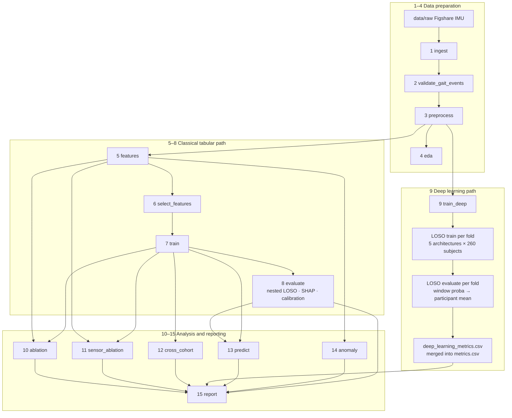

# Pipeline flow (conceptual architecture)

This document describes **what each stage depends on scientifically**, not every file read at runtime.  
Implementation: `fall_risk_pipeline/main.py` (`STAGES` list, run in order for `python main.py` with no `--stage`).

## Architecture diagram



### Reading the diagram

| Idea | Meaning |
|------|---------|
| **Linear run order** | `main.py` runs stages **1 → 15** when you omit `--stage`. |
| **No S6 → S12 / S6 → S13** | Cross-cohort and predict depend on the **trained model protocol** (S7), not on RFECV as a separate scientific step. Feature selection is already embodied in S7. |
| **S5 → ablation / sensor_ablation** | Those stages use the **full** patient feature matrix (`use_selected=False`). |
| **S7 → post (tabular)** | Checkpoints and classifier hyperparameters from `train`. |
| **S8 → predict / report** | LOSO metrics, OOF predictions, figures, clinical threshold. |
| **S9 sub-steps** | There is no separate `evaluate_deep` stage; LOSO training and evaluation both live inside `train_deep`. |

**Prerequisite (one line):** Stages **7–8** and **10–13** assume **5 → 6** have completed. Edges into S7 mean “tabular models trained on the selected feature set,” not raw signals alone.

## Does the code follow this flow?

**Yes**, with these clarifications:

| Stage | Matches diagram? | How it is implemented |
|-------|------------------|------------------------|
| 1–4 | Yes | Sequential data prep; EDA only needs preprocess. |
| 5–8 | Yes | `features` → `select_features` → `train` → `evaluate` in `STAGES`. |
| 9 | Yes | `DeepLearningPipeline` reads `signals_clean/`, runs LOSO train+eval per architecture, writes `deep_learning_metrics.csv`. |
| 10 | Yes | `feature_ablation`: full matrix (S5) + `xgboost.pkl` (S7). |
| 11 | Yes | `sensor_ablation`: full matrix (S5) + checkpoint (S7). |
| 12 | Yes | `cross_cohort`: clones checkpoint (S7), loads patient matrix with **selected** columns (same as training — produced only after S6, consumed via S7’s training path). |
| 13 | Yes | `predict`: best model from `metrics.csv` (S8) + checkpoint (S7) + selected features. |
| 14 | Yes | `anomaly`: `trial_features.parquet` (S5) only; **not** downstream of `predict`. |
| 15 | Yes | `report` aggregates metrics, ablations, DL CSV if present, demographics. |

**Execution vs architecture**

- **`python main.py` (all stages):** Always runs **1→15** in order; that is the safe reproducible path.
- **Partial runs:** Must respect the diagram (e.g. do not run `cross_cohort` before `train`).
- **Failure behavior:** `main.py` **exits on first failed stage**; a later stage in the same invocation will not run (your batch continued only because each stage was a separate shell command).

**Your recent run:** Classical path through **report** is complete; **`train_deep`** is the optional parallel branch (stage 9), not skipped by design when you run the full pipeline — it is long and often started separately.

## Stage reference (15 stages)

| # | Stage | Primary outputs |
|---|--------|-----------------|
| 1 | `ingest` | `trial_metadata.csv`, trial folders |
| 2 | `validate_gait_events` | Gait-event validation reports |
| 3 | `preprocess` | `signals_clean/*.parquet` |
| 4 | `eda` | `results/figures/eda/` |
| 5 | `features` | `trial_features.parquet`, `patient_features.parquet` |
| 6 | `select_features` | `patient_features_selected.parquet`, `selected_features.json` |
| 7 | `train` | `results/checkpoints/*.pkl` |
| 8 | `evaluate` | `metrics.csv`, ROC/calibration figures, `oof_predictions.parquet` |
| 9 | `train_deep` | `deep_learning_metrics.csv` (+ LOSO metrics per DL model) |
| 10 | `ablation` | `feature_ablation.csv`, bar charts |
| 11 | `sensor_ablation` | `sensor_ablation.csv` |
| 12 | `cross_cohort` | `cross_cohort_transfer.csv`, pairwise heatmap |
| 13 | `predict` | `predictions.csv` |
| 14 | `anomaly` | `results/anomaly_detection/` |
| 15 | `report` | `pipeline_report.md`, `ieee_table.tex` |

## Labels and evaluation

- **Task:** 3-class pathology-tier screening (`multiclass_label`: 0 Healthy, 1 orthopedic, 2 neurological).
- **Primary CV:** leave-one-**subject**-out (260 participants), for both tabular (stage 8) and deep (stage 9).

## Commands

```bash
cd fall_risk_pipeline

# Full pipeline (recommended first time)
python main.py --config configs/pipeline_config.yaml

# Tabular core only
python main.py --stage features
python main.py --stage select_features
python main.py --stage train
python main.py --stage evaluate

# Deep learning (long; GPU recommended)
python main.py --stage train_deep
python main.py --stage report   # refresh report after DL finishes
```

See also: [`fall_risk_pipeline/README.md`](../fall_risk_pipeline/README.md), [`reproducibility.md`](reproducibility.md).
