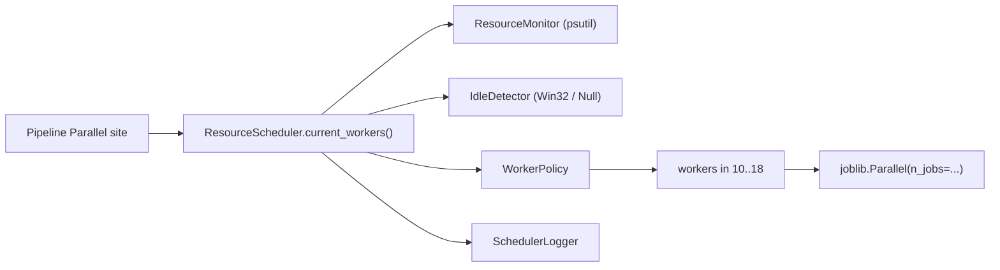

# Resource-Aware Scheduler

Adaptive worker selection for `joblib.Parallel` stages (Nested FS, LOSO ablations,
SHAP folds, classical baselines, etc.). Replaces fixed `nested_fs_n_jobs` fan-out
with a policy that reacts to user idle time and RAM pressure.

## Architecture



Package layout (`fall_risk_pipeline/src/core/resources/`):

| Module | Responsibility |
|--------|----------------|
| `resource_monitor.py` | Cross-platform RAM/CPU samples (`psutil`) |
| `idle_detector.py` | Cached keyboard/mouse idle seconds (Windows now; Null elsewhere) |
| `worker_policy.py` | Priority rules + hysteresis / cooldown |
| `scheduler_logger.py` | Console / optional file decision audit |
| `resource_scheduler.py` | Public façade + process-scoped registry |

## Scheduling policy

| Condition | Workers |
|-----------|---------|
| Pipeline start / user active (idle &lt; 5 min) | **14** |
| Idle ≥ 5 minutes | **16** |
| Idle ≥ 15 minutes | **18** |
| RAM usage &gt; 85% | **12** |
| RAM usage &gt; 92% | **10** (immediate emergency) |
| User activity resumes | **14** immediately |

Hard clamps: never below **10**, never above **18**. Also capped by `cpu_count - 1`.

Priority: RAM-critical → RAM-high → idle-15 → idle-5 → baseline.

### Stability (hysteresis)

- Non-emergency evaluations at most every **30 s**.
- Worker **increases** require the target condition to hold for **60 s**.
- After an increase, **120 s** cooldown before another increase.
- RAM **&gt; 92%** bypasses interval / hold / cooldown and decreases immediately.
- Decreases for RAM-high or activity resume apply immediately.

## Public API

```python
from src.core.resources import ResourceScheduler, parallel_n_jobs, get_resource_scheduler

scheduler = ResourceScheduler()          # DI-friendly constructor
workers = scheduler.current_workers()

# Process-scoped (hysteresis persists across Parallel calls):
n_jobs = parallel_n_jobs()
# equivalent: get_resource_scheduler().current_workers()
```

Call sites query **before** each major `Parallel(...)` (evaluator Nested FS + LOSO
sweeps, feature/sensor ablation, classical baselines).

## Class responsibilities

- **ResourceMonitor** — `ram_percent`, `ram_available_gb`, `cpu_percent`, `timestamp`, `snapshot`. No Win32.
- **IdleDetector** — `idle_seconds()`; Windows uses `GetLastInputInfo` with ≥5 s cache.
- **WorkerPolicy** — pure decision logic; injectable `SchedulerPolicyConfig` constants.
- **SchedulerLogger** — formats `[HH:MM:SS] Workers A -> B` records.
- **ResourceScheduler** — thread-safe orchestration; pipeline never imports policy details.

## Configuration

`configs/pipeline_config.yaml`:

```yaml
feature_selection:
  nested_fs_n_jobs: 14   # fingerprint / legacy only; runtime uses scheduler

resource_scheduler:
  enabled: true
  console_log: true
  log_file: null
```

## Extension guide

1. **Linux/macOS idle** — add adapters in `idle_detector.py` and branch in `create_idle_detector`.
2. **New policy knobs** — extend `SchedulerPolicyConfig` (frozen dataclass); keep magic numbers out of call sites.
3. **Stage-specific caps** — wrap `parallel_n_jobs()` or pass a dedicated `ResourceScheduler` with a custom config into a stage (DI); do not add globals.
4. **Optional file audit** — `SchedulerLogger(log_path=...)`.

## Future improvements

- Optional temperature / power-profile hooks (explicitly out of scope today).
- Per-stage worker budgets (Nested FS vs SHAP).
- Prometheus / OpenTelemetry metrics export.
- cgroup-aware RAM limits on Linux HPC.

## Overhead

Designed for &lt; 0.2% CPU and &lt; 50 MB RSS: non-blocking `psutil` samples, idle
queries cached ≥5 s, evaluation gated to 30 s, no background threads.
